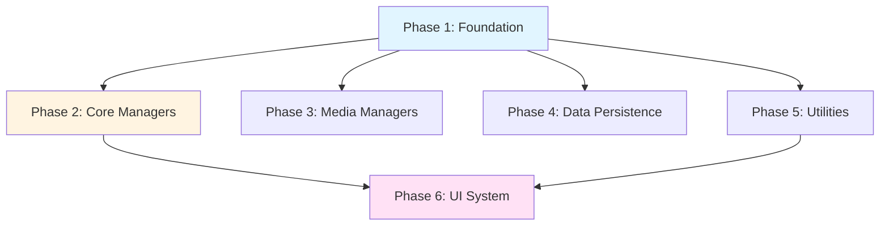

# LNA Implementation Plan

このドキュメントは、LNAライブラリの実装計画の総合インデックスです。

## プラットフォーム別実装計画

各プラットフォームの詳細な実装計画（クラス設計、Mermaidクラス図、依存関係図を含む）は、以下のドキュメントを参照してください。

### 📘 Unity (C#)
**詳細:** [docs/unity/IMPLEMENTATION_PLAN.md](docs/unity/IMPLEMENTATION_PLAN.md)

- シングルトンパターン (`Singleton<T>`)
- LNAManager による統合アクセス
- StateMachine (ジェネリック型対応)
- EventSystem (デリゲートベース)
- InputManager, SceneManager, GameFlowManager
- Unity特有のMonoBehaviourライフサイクルに対応

### 📗 Godot (GDScript)
**詳細:** [docs/godot/IMPLEMENTATION_PLAN.md](docs/godot/IMPLEMENTATION_PLAN.md)

- Autoloadシステムの活用
- LNAManager (グローバルアクセス)
- StateMachine (Nodeベース)
- EventSystem (シグナル活用)
- InputManager, SceneManager, GameFlowManager
- Godot特有のノードシステムとシグナルに対応

### 📕 Playdate (C)
**詳細:** [docs/playdate/IMPLEMENTATION_PLAN.md](docs/playdate/IMPLEMENTATION_PLAN.md)

- グローバルマネージャー構造体
- lna_manager による統合アクセス
- StateMachine (関数ポインタベース)
- EventSystem (コールバックベース)
- input_manager, scene_manager, game_flow_manager
- メモリ効率とPlaydate特有のクランク入力に対応

---

## 実装フェーズ概要

以下は全プラットフォーム共通の実装フェーズです。詳細は各プラットフォームのドキュメントを参照してください。

## Phase 1: 基礎インフラ（Foundation）

### 含まれる機能
- シングルトンシステム / LNAManager
- StateMachine（汎用ステートマシン）
- EventSystem（イベント通知システム）

**実装詳細:**
- [Unity実装](docs/unity/IMPLEMENTATION_PLAN.md#phase-1-基礎インフラ)
- [Godot実装](docs/godot/IMPLEMENTATION_PLAN.md#phase-1-基礎インフラ)
- [Playdate実装](docs/playdate/IMPLEMENTATION_PLAN.md#phase-1-基礎インフラ)

---

## Phase 2: コアマネージャー（Core Managers）

### 含まれる機能
- InputManager（入力管理）
- SceneManager（シーン遷移管理）
- GameFlowManager（ゲームフロー管理）

**実装詳細:**
- [Unity実装](docs/unity/IMPLEMENTATION_PLAN.md#phase-2-コアマネージャー)
- [Godot実装](docs/godot/IMPLEMENTATION_PLAN.md#phase-2-コアマネージャー)
- [Playdate実装](docs/playdate/IMPLEMENTATION_PLAN.md#phase-2-コアマネージャー)

---

## Phase 3: メディアマネージャー（Media Managers）

### 含まれる機能
- AudioManager（サウンド管理）
- ResourceManager（リソース管理）

**依存:** Phase 1

**実装詳細:** 各プラットフォームのドキュメントを参照

---

## Phase 4: データ永続化（Data Persistence）

### 含まれる機能
- SaveDataManager（セーブデータ管理）

**依存:** Phase 1

**実装詳細:** 各プラットフォームのドキュメントを参照

---

## Phase 5: ユーティリティ（Utilities）

### 含まれる機能
- Timer（タイマー機能）
- Tween（補間・イージング）
- ObjectPool（オブジェクトプール）

**依存:** Phase 1（Timerは依存なし）

**実装詳細:** 各プラットフォームのドキュメントを参照

---

## Phase 6: UIシステム（UI System）

### 含まれる機能
- UIManager（UI表示管理）
- DialogSystem（ダイアログ・メッセージ）
- TransitionEffect（画面遷移エフェクト）

**依存:** Phase 1, Phase 5 (Tween)

**実装詳細:** 各プラットフォームのドキュメントを参照

---

## 全体依存関係図

---

## プラットフォーム別の主な違い

| 機能 | Unity | Godot | Playdate |
|------|-------|-------|----------|
| **シングルトン** | `Singleton<T>` 基底クラス | Autoload | グローバル構造体 |
| **イベント** | Delegate | シグナル / カスタム実装 | 関数ポインタ |
| **状態管理** | ジェネリック型 | Node継承 | 関数ポインタ |
| **入力** | Input API ラッパー | InputMap ラッパー | PDButtons + クランク |
| **シーン** | SceneManager API | get_tree() | 関数ポインタコールバック |
| **言語** | C# | GDScript | C |

---

## 実装の進め方

### 推奨順序

1. **Phase 1 を全プラットフォームで実装**
   - Unity → Godot → Playdate の順で実装
   - 各プラットフォームでテストとサンプル作成

2. **Phase 2 を全プラットフォームで実装**
   - 基礎インフラ上に構築
   - デモゲームで動作確認

3. **Phase 3以降を必要に応じて実装**
   - プロジェクトの要件に応じて優先順位を調整

### マイルストーン

#### Milestone 1: 基礎インフラ完成
- [ ] Phase 1 を Unity, Godot, Playdate で実装
- [ ] 各プラットフォームでサンプルプロジェクト動作確認

#### Milestone 2: コアマネージャー完成
- [ ] Phase 2 を Unity, Godot, Playdate で実装
- [ ] タイトル→ゲーム→結果 のフローが動作するデモ完成

#### Milestone 3: フル機能完成
- [ ] Phase 3-6 実装完了
- [ ] 実戦的なゲームが作成可能

---

## 次のステップ

1. 各プラットフォームの実装計画ドキュメントを確認
   - [Unity実装計画](docs/unity/IMPLEMENTATION_PLAN.md)
   - [Godot実装計画](docs/godot/IMPLEMENTATION_PLAN.md)
   - [Playdate実装計画](docs/playdate/IMPLEMENTATION_PLAN.md)

2. Phase 1 の実装開始（Unity から推奨）

3. 実装完了後、このドキュメントのチェックリストを更新
