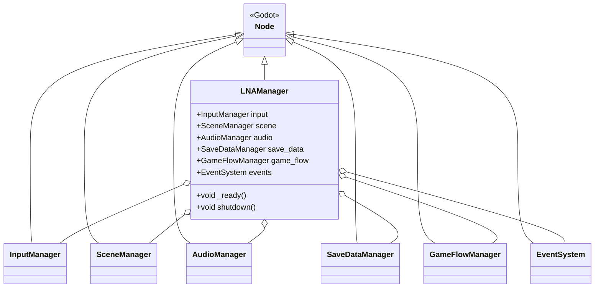
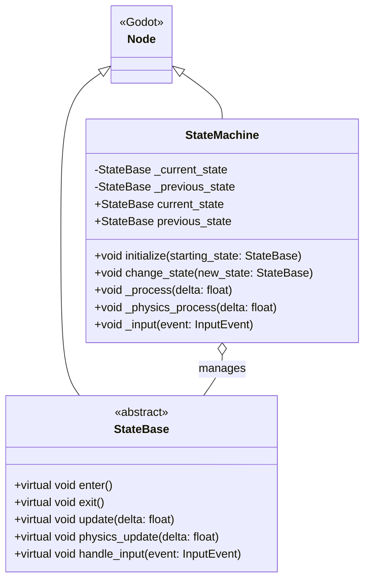
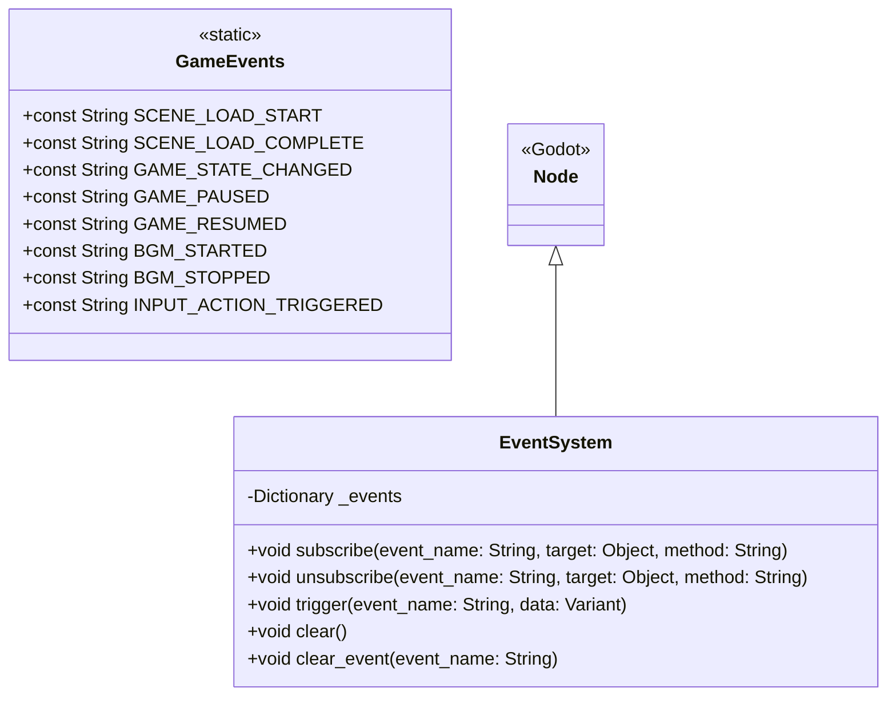
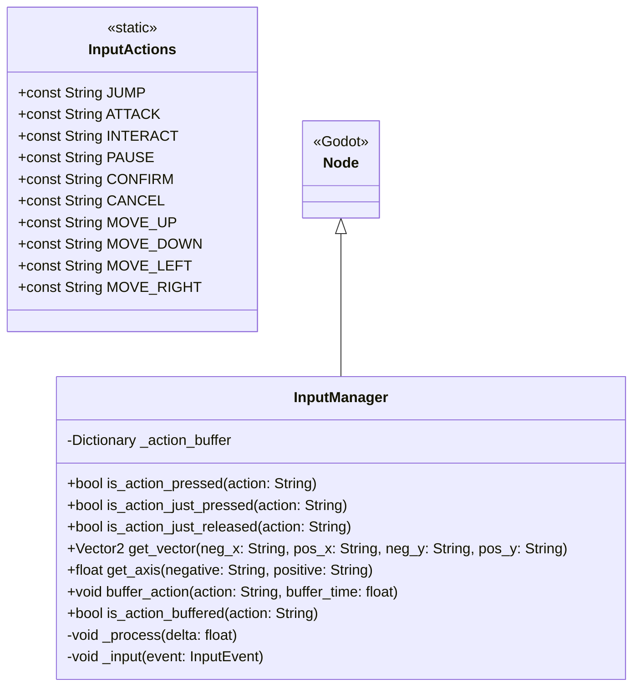
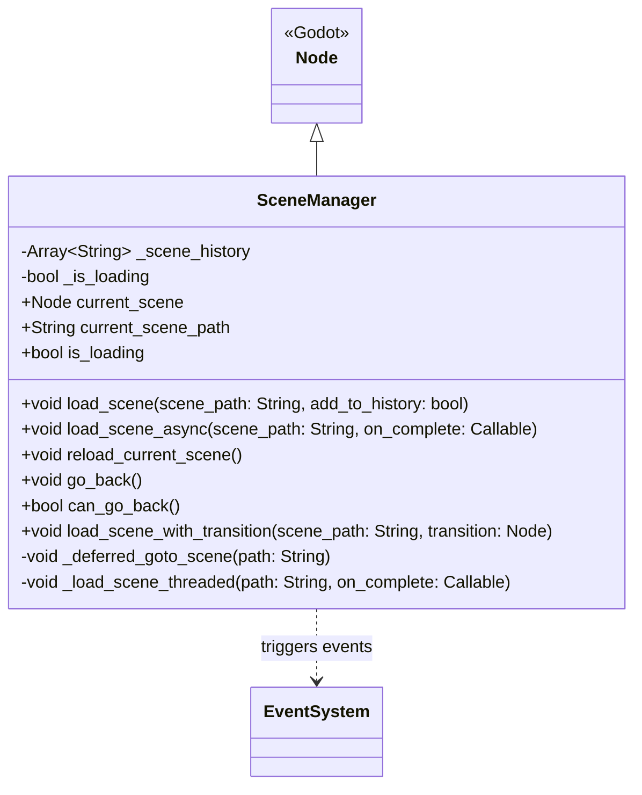
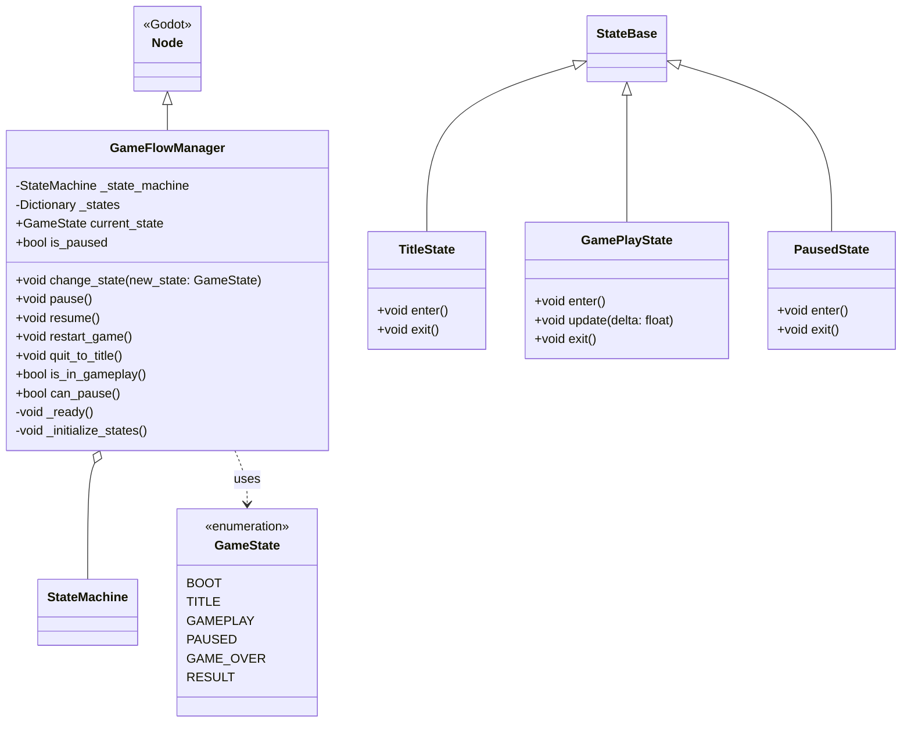

# Godot Implementation Plan

Godot 4.x (GDScript) 向けのLNA実装計画書です。

## 目次

- [Phase 1: 基礎インフラ](#phase-1-基礎インフラ)
- [Phase 2: コアマネージャー](#phase-2-コアマネージャー)
- [Phase 3: メディアマネージャー](#phase-3-メディアマネージャー)
- [Phase 4: データ永続化](#phase-4-データ永続化)
- [Phase 5: ユーティリティ](#phase-5-ユーティリティ)
- [Phase 6: UIシステム](#phase-6-uiシステム)
- [全体アーキテクチャ](#全体アーキテクチャ)

---

## Godot特有の設計方針

### Autoloadシステムの活用

Godotでは、Autoload（シングルトン）を使用してグローバルにアクセス可能なノードを作成します。
`LNAManager`や各マネージャーはAutoloadとして登録します。

### シグナルの活用

Godotのシグナルシステムを活用して、イベント駆動型の設計を実現します。
`EventSystem`は内部的にシグナルを使用します。

### ノードベースの設計

可能な限りノードを継承し、Godotのシーンツリーに統合可能な設計にします。

---

## Phase 1: 基礎インフラ

### 1.1 LNAManager (Autoload)

#### クラス図



#### ファイル構成

```
godot/addons/lna/core/
└── lna_manager.gd
```

#### 実装詳細

**lna_manager.gd**

```gdscript
extends Node
## LNA Manager - Central access point for all LNA systems
##
## This should be registered as an Autoload in Project Settings.
## Provides easy access to all manager instances.

# Manager instances
var input: InputManager
var scene: SceneManager
var audio: AudioManager
var save_data: SaveDataManager
var game_flow: GameFlowManager
var events: EventSystem

func _ready() -> void:
	print("[LNAManager] Initializing all managers...")

	# Create manager instances
	events = EventSystem.new()
	add_child(events)
	events.name = "EventSystem"

	input = InputManager.new()
	add_child(input)
	input.name = "InputManager"

	scene = SceneManager.new()
	add_child(scene)
	scene.name = "SceneManager"

	audio = AudioManager.new()
	add_child(audio)
	audio.name = "AudioManager"

	save_data = SaveDataManager.new()
	add_child(save_data)
	save_data.name = "SaveDataManager"

	game_flow = GameFlowManager.new()
	add_child(game_flow)
	game_flow.name = "GameFlowManager"

	print("[LNAManager] All managers initialized.")

func shutdown() -> void:
	print("[LNAManager] Shutting down all managers...")

	# Cleanup
	if game_flow:
		game_flow.queue_free()
	if save_data:
		save_data.queue_free()
	if audio:
		audio.queue_free()
	if scene:
		scene.queue_free()
	if input:
		input.queue_free()
	if events:
		events.queue_free()
```

---

### 1.2 StateMachine

#### クラス図



#### ファイル構成

```
godot/addons/lna/core/state_machine/
├── state_base.gd
└── state_machine.gd
```

#### 実装詳細

**state_base.gd**

```gdscript
extends Node
class_name StateBase
## Base class for all states
##
## Inherit from this class to create custom states.
## Override the virtual methods to define state behavior.

## Called when entering this state
func enter() -> void:
	pass

## Called when exiting this state
func exit() -> void:
	pass

## Called every frame while in this state
func update(_delta: float) -> void:
	pass

## Called every physics frame while in this state
func physics_update(_delta: float) -> void:
	pass

## Called when input is received while in this state
func handle_input(_event: InputEvent) -> void:
	pass
```

**state_machine.gd**

```gdscript
extends Node
class_name StateMachine
## Generic state machine
##
## Manages state transitions and updates.

var current_state: StateBase = null
var previous_state: StateBase = null

## Initialize the state machine with a starting state
func initialize(starting_state: StateBase) -> void:
	current_state = starting_state
	if current_state:
		current_state.enter()

## Change to a new state
func change_state(new_state: StateBase) -> void:
	if current_state == new_state:
		push_warning("[StateMachine] Already in state %s" % new_state)
		return

	if current_state:
		current_state.exit()

	previous_state = current_state
	current_state = new_state

	if current_state:
		current_state.enter()

func _process(delta: float) -> void:
	if current_state:
		current_state.update(delta)

func _physics_process(delta: float) -> void:
	if current_state:
		current_state.physics_update(delta)

func _input(event: InputEvent) -> void:
	if current_state:
		current_state.handle_input(event)
```

---

### 1.3 EventSystem

#### クラス図



#### ファイル構成

```
godot/addons/lna/core/event_system/
├── event_system.gd
└── game_events.gd
```

#### 実装詳細

**event_system.gd**

```gdscript
extends Node
class_name EventSystem
## Event system for decoupled communication
##
## Subscribe to events and trigger them to notify listeners.

# Event storage: { event_name: [{ target: Object, method: String }] }
var _events: Dictionary = {}

## Subscribe to an event
func subscribe(event_name: String, target: Object, method: String) -> void:
	if not _events.has(event_name):
		_events[event_name] = []

	var listener := { "target": target, "method": method }

	# Avoid duplicate subscriptions
	for existing in _events[event_name]:
		if existing.target == target and existing.method == method:
			push_warning("[EventSystem] Already subscribed: %s.%s to %s" % [target, method, event_name])
			return

	_events[event_name].append(listener)

## Unsubscribe from an event
func unsubscribe(event_name: String, target: Object, method: String) -> void:
	if not _events.has(event_name):
		return

	var listeners: Array = _events[event_name]
	for i in range(listeners.size() - 1, -1, -1):
		var listener = listeners[i]
		if listener.target == target and listener.method == method:
			listeners.remove_at(i)

	# Clean up empty event lists
	if listeners.is_empty():
		_events.erase(event_name)

## Trigger an event
func trigger(event_name: String, data = null) -> void:
	if not _events.has(event_name):
		return

	var listeners: Array = _events[event_name]

	# Call all listeners
	for listener in listeners:
		var target = listener.target
		var method = listener.method

		# Check if target is still valid
		if not is_instance_valid(target):
			continue

		if target.has_method(method):
			if data != null:
				target.call(method, data)
			else:
				target.call(method)
		else:
			push_warning("[EventSystem] Method %s not found on %s" % [method, target])

## Clear all events
func clear() -> void:
	_events.clear()

## Clear a specific event
func clear_event(event_name: String) -> void:
	_events.erase(event_name)
```

**game_events.gd**

```gdscript
extends Object
class_name GameEvents
## Common game event names
##
## Use these constants for consistent event naming.

# Scene events
const SCENE_LOAD_START := "scene.load.start"
const SCENE_LOAD_COMPLETE := "scene.load.complete"
const SCENE_UNLOAD := "scene.unload"

# Game flow events
const GAME_STATE_CHANGED := "gameflow.state.changed"
const GAME_PAUSED := "gameflow.paused"
const GAME_RESUMED := "gameflow.resumed"

# Audio events
const BGM_STARTED := "audio.bgm.started"
const BGM_STOPPED := "audio.bgm.stopped"
const BGM_FADED := "audio.bgm.faded"
const SFX_PLAYED := "audio.sfx.played"

# Input events
const INPUT_ACTION_TRIGGERED := "input.action.triggered"

# Save/Load events
const SAVE_COMPLETED := "savedata.save.completed"
const LOAD_COMPLETED := "savedata.load.completed"
```

---

## Phase 2: コアマネージャー

### 2.1 InputManager

#### クラス図



#### ファイル構成

```
godot/addons/lna/core/
├── input_manager.gd
└── input_actions.gd
```

#### 実装詳細

**input_manager.gd**

```gdscript
extends Node
class_name InputManager
## Input manager with buffering support
##
## Provides a thin wrapper around Godot's Input system
## with added features like input buffering.

# Input buffering: { action_name: time_remaining }
var _action_buffer: Dictionary = {}

## Check if action is currently pressed
func is_action_pressed(action: String) -> bool:
	return Input.is_action_pressed(action)

## Check if action was just pressed this frame
func is_action_just_pressed(action: String) -> bool:
	return Input.is_action_just_pressed(action)

## Check if action was just released this frame
func is_action_just_released(action: String) -> bool:
	return Input.is_action_just_released(action)

## Get vector input from four directional actions
func get_vector(negative_x: String, positive_x: String, negative_y: String, positive_y: String) -> Vector2:
	return Input.get_vector(negative_x, positive_x, negative_y, positive_y)

## Get axis input from two actions
func get_axis(negative: String, positive: String) -> float:
	return Input.get_axis(negative, positive)

## Buffer an action for a short time (useful for frame-perfect inputs)
func buffer_action(action: String, buffer_time: float = 0.1) -> void:
	_action_buffer[action] = buffer_time

## Check if an action is buffered
func is_action_buffered(action: String) -> bool:
	return _action_buffer.has(action) and _action_buffer[action] > 0.0

func _process(delta: float) -> void:
	# Update action buffers
	var actions_to_remove: Array[String] = []

	for action in _action_buffer.keys():
		_action_buffer[action] -= delta
		if _action_buffer[action] <= 0.0:
			actions_to_remove.append(action)

	for action in actions_to_remove:
		_action_buffer.erase(action)

func _input(event: InputEvent) -> void:
	# Auto-buffer just-pressed actions
	if event.is_action_pressed("ui_accept"):
		buffer_action("ui_accept")

	# Trigger input events
	# (You can expand this based on your needs)
	pass
```

**input_actions.gd**

```gdscript
extends Object
class_name InputActions
## Common input action names
##
## These should be defined in Project Settings > Input Map

const JUMP := "jump"
const ATTACK := "attack"
const INTERACT := "interact"
const PAUSE := "pause"
const CONFIRM := "confirm"
const CANCEL := "cancel"
const MOVE_UP := "move_up"
const MOVE_DOWN := "move_down"
const MOVE_LEFT := "move_left"
const MOVE_RIGHT := "move_right"
```

---

### 2.2 SceneManager

#### クラス図



#### 実装詳細

**scene_manager.gd**

```gdscript
extends Node
class_name SceneManager
## Scene manager for loading and transitioning between scenes

var current_scene: Node = null
var current_scene_path: String = ""
var is_loading: bool = false

# Scene history for back navigation
var _scene_history: Array[String] = []

func _ready() -> void:
	# Get the current scene
	var root = get_tree().root
	current_scene = root.get_child(root.get_child_count() - 1)
	current_scene_path = current_scene.scene_file_path

## Load a scene synchronously
func load_scene(scene_path: String, add_to_history: bool = true) -> void:
	if is_loading:
		push_warning("[SceneManager] Already loading a scene. Cannot load '%s'." % scene_path)
		return

	if add_to_history and not current_scene_path.is_empty():
		_scene_history.append(current_scene_path)

	LNAManager.events.trigger(GameEvents.SCENE_LOAD_START, scene_path)

	# Defer the actual scene change
	call_deferred("_deferred_goto_scene", scene_path)

## Load a scene asynchronously
func load_scene_async(scene_path: String, on_complete: Callable = Callable()) -> void:
	if is_loading:
		push_warning("[SceneManager] Already loading a scene. Cannot load '%s'." % scene_path)
		return

	is_loading = true
	_load_scene_threaded(scene_path, on_complete)

## Reload the current scene
func reload_current_scene() -> void:
	load_scene(current_scene_path, false)

## Go back to the previous scene
func go_back() -> void:
	if not can_go_back():
		push_warning("[SceneManager] No scene to go back to.")
		return

	var previous_scene = _scene_history.pop_back()
	load_scene(previous_scene, false)

## Check if we can go back
func can_go_back() -> bool:
	return _scene_history.size() > 0

## Internal: Deferred scene change
func _deferred_goto_scene(path: String) -> void:
	# Free the current scene
	if current_scene:
		current_scene.free()

	# Load the new scene
	var new_scene = load(path).instantiate()

	# Add it to the scene tree
	get_tree().root.add_child(new_scene)
	get_tree().current_scene = new_scene

	# Update references
	current_scene = new_scene
	current_scene_path = path

	LNAManager.events.trigger(GameEvents.SCENE_LOAD_COMPLETE, path)

## Internal: Threaded scene loading
func _load_scene_threaded(path: String, on_complete: Callable) -> void:
	# Start loading
	ResourceLoader.load_threaded_request(path)

	# Wait for loading to complete
	while true:
		var progress = []
		var status = ResourceLoader.load_threaded_get_status(path, progress)

		if status == ResourceLoader.THREAD_LOAD_LOADED:
			break
		elif status == ResourceLoader.THREAD_LOAD_FAILED or status == ResourceLoader.THREAD_LOAD_INVALID_RESOURCE:
			push_error("[SceneManager] Failed to load scene: %s" % path)
			is_loading = false
			return

		await get_tree().process_frame

	# Get the loaded resource
	var packed_scene = ResourceLoader.load_threaded_get(path)

	# Instantiate and change scene
	call_deferred("_deferred_goto_scene", path)
	is_loading = false

	if on_complete.is_valid():
		on_complete.call()
```

---

### 2.3 GameFlowManager

#### クラス図



#### ファイル構成

```
godot/addons/lna/core/
├── game_flow_manager.gd
└── game_flow_states/
    ├── boot_state.gd
    ├── title_state.gd
    ├── gameplay_state.gd
    ├── paused_state.gd
    ├── game_over_state.gd
    └── result_state.gd
```

#### 実装詳細（抜粋）

**game_flow_manager.gd**

```gdscript
extends Node
class_name GameFlowManager
## Game flow manager
##
## Manages the overall game state (title, gameplay, pause, etc.)

enum GameState {
	BOOT,
	TITLE,
	GAMEPLAY,
	PAUSED,
	GAME_OVER,
	RESULT
}

var _state_machine: StateMachine
var _states: Dictionary = {}

var current_state: GameState:
	get:
		if _state_machine and _state_machine.current_state:
			return _state_machine.current_state.state_type
		return GameState.BOOT

var is_paused: bool = false

func _ready() -> void:
	_state_machine = StateMachine.new()
	add_child(_state_machine)

	_initialize_states()
	_state_machine.initialize(_states[GameState.BOOT])

func _initialize_states() -> void:
	# Load state scripts
	var BootState = load("res://addons/lna/core/game_flow_states/boot_state.gd")
	var TitleState = load("res://addons/lna/core/game_flow_states/title_state.gd")
	var GamePlayState = load("res://addons/lna/core/game_flow_states/gameplay_state.gd")
	var PausedState = load("res://addons/lna/core/game_flow_states/paused_state.gd")
	var GameOverState = load("res://addons/lna/core/game_flow_states/game_over_state.gd")
	var ResultState = load("res://addons/lna/core/game_flow_states/result_state.gd")

	# Instantiate states
	_states[GameState.BOOT] = BootState.new()
	_states[GameState.TITLE] = TitleState.new()
	_states[GameState.GAMEPLAY] = GamePlayState.new()
	_states[GameState.PAUSED] = PausedState.new()
	_states[GameState.GAME_OVER] = GameOverState.new()
	_states[GameState.RESULT] = ResultState.new()

	# Add as children
	for state in _states.values():
		_state_machine.add_child(state)

## Change to a new game state
func change_state(new_state: GameState) -> void:
	if _states.has(new_state):
		_state_machine.change_state(_states[new_state])
		LNAManager.events.trigger(GameEvents.GAME_STATE_CHANGED, new_state)
	else:
		push_error("[GameFlowManager] State %s not found!" % new_state)

## Pause the game
func pause() -> void:
	if not can_pause():
		return

	is_paused = true
	get_tree().paused = true
	change_state(GameState.PAUSED)
	LNAManager.events.trigger(GameEvents.GAME_PAUSED)

## Resume the game
func resume() -> void:
	is_paused = false
	get_tree().paused = false
	change_state(GameState.GAMEPLAY)
	LNAManager.events.trigger(GameEvents.GAME_RESUMED)

## Restart the current game
func restart_game() -> void:
	LNAManager.scene.reload_current_scene()

## Quit to title screen
func quit_to_title() -> void:
	get_tree().paused = false
	is_paused = false
	LNAManager.scene.load_scene("res://scenes/title.tscn", false)
	change_state(GameState.TITLE)

## Query functions
func is_in_gameplay() -> bool:
	return current_state == GameState.GAMEPLAY

func can_pause() -> bool:
	return current_state == GameState.GAMEPLAY
```

---

## 全体アーキテクチャ

### 依存関係図

```mermaid
graph TD
    A[Node] --> B[EventSystem]
    A --> C[InputManager]
    A --> D[SceneManager]
    A --> E[GameFlowManager]
    A --> F[AudioManager]
    A --> G[SaveDataManager]
    A --> H[StateMachine]

    H --> E
    H --> D

    B --> C
    B --> D
    B --> E
    B --> F
    B --> G

    C --> E
    D --> E

    I[LNAManager<br/>Autoload] o-- B
    I o-- C
    I o-- D
    I o-- E
    I o-- F
    I o-- G

    style A fill:#e1f5ff
    style H fill:#e1f5ff
    style I fill:#ffe1e1
```

### Autoload設定

プロジェクト設定で以下のAutoloadを登録してください：

| 名前 | パス | 説明 |
|-----|------|------|
| `LNAManager` | `res://addons/lna/core/lna_manager.gd` | 統合マネージャー |

### クラス一覧とファイルパス

| クラス名 | ファイルパス | 説明 |
|---------|-------------|------|
| `LNAManager` | `godot/addons/lna/core/lna_manager.gd` | 統合アクセサ (Autoload) |
| `StateBase` | `godot/addons/lna/core/state_machine/state_base.gd` | State基底クラス |
| `StateMachine` | `godot/addons/lna/core/state_machine/state_machine.gd` | ステートマシン |
| `EventSystem` | `godot/addons/lna/core/event_system/event_system.gd` | イベントシステム |
| `GameEvents` | `godot/addons/lna/core/event_system/game_events.gd` | イベント定数 |
| `InputManager` | `godot/addons/lna/core/input_manager.gd` | 入力管理 |
| `InputActions` | `godot/addons/lna/core/input_actions.gd` | 入力アクション定数 |
| `SceneManager` | `godot/addons/lna/core/scene_manager.gd` | シーン管理 |
| `GameFlowManager` | `godot/addons/lna/core/game_flow_manager.gd` | ゲームフロー管理 |

---

## Phase 3以降

Phase 3 (AudioManager, ResourceManager), Phase 4 (SaveDataManager), Phase 5 (Timer, Tween, ObjectPool), Phase 6 (UI Systems) の詳細設計も同様に行います。

---

## 実装チェックリスト

### Milestone 1: 基礎インフラ

- [ ] `LNAManager` (Autoload) 実装
- [ ] `StateBase` 実装
- [ ] `StateMachine` 実装
- [ ] `EventSystem` 実装
- [ ] `GameEvents` 定義
- [ ] テストシーン作成
- [ ] サンプルプロジェクト作成

### Milestone 2: コアマネージャー

- [ ] `InputManager` 実装
- [ ] `InputActions` 定義
- [ ] `SceneManager` 実装
- [ ] `GameFlowManager` 実装
- [ ] ゲームステート実装 (6種類)
- [ ] 統合テスト作成
- [ ] デモゲーム作成（タイトル→ゲーム→結果）

---

## 次のステップ

1. Milestone 1 の実装開始
2. 各クラスのテストシーン作成
3. サンプルプロジェクトで動作確認
4. Milestone 2 へ進む
