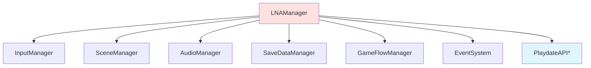
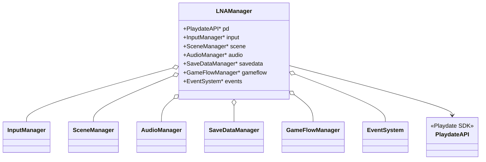
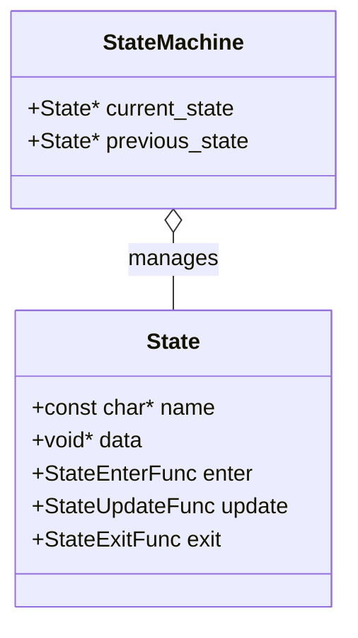
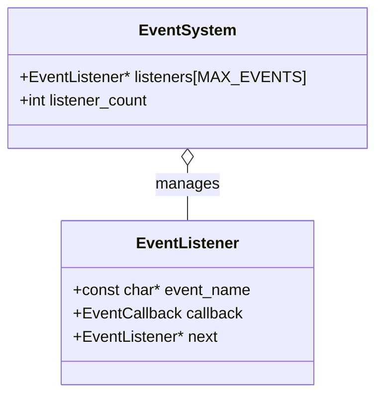
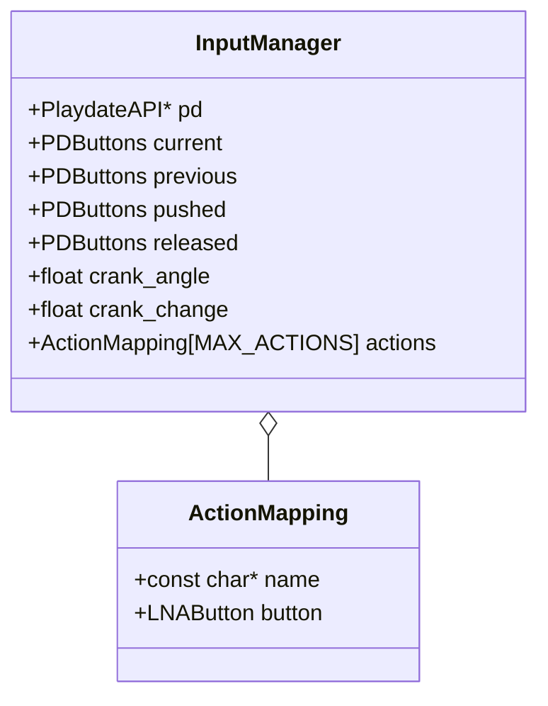
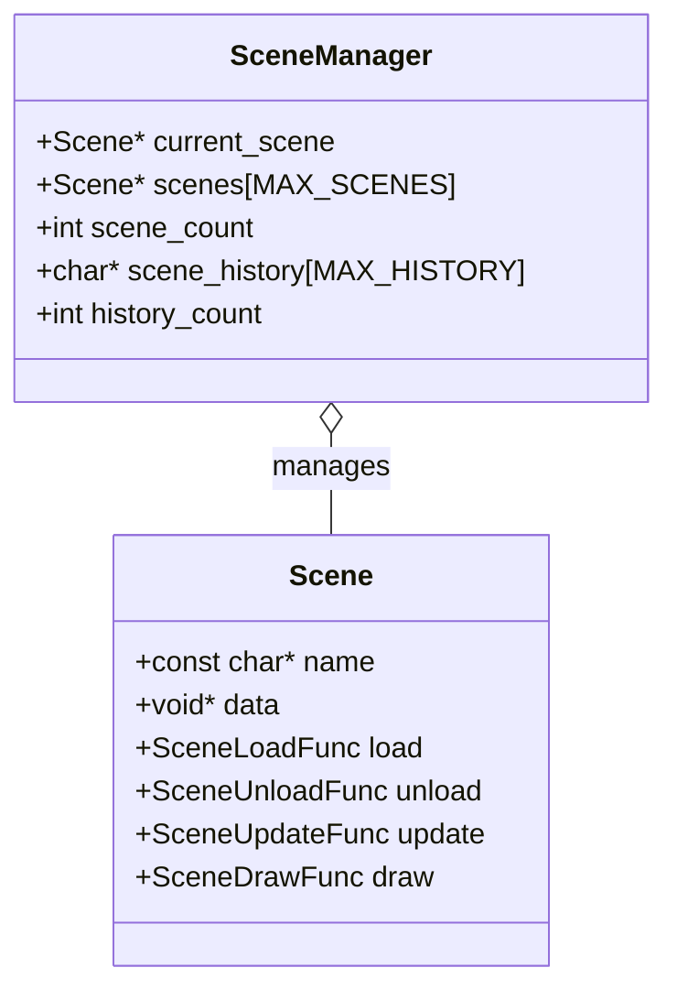
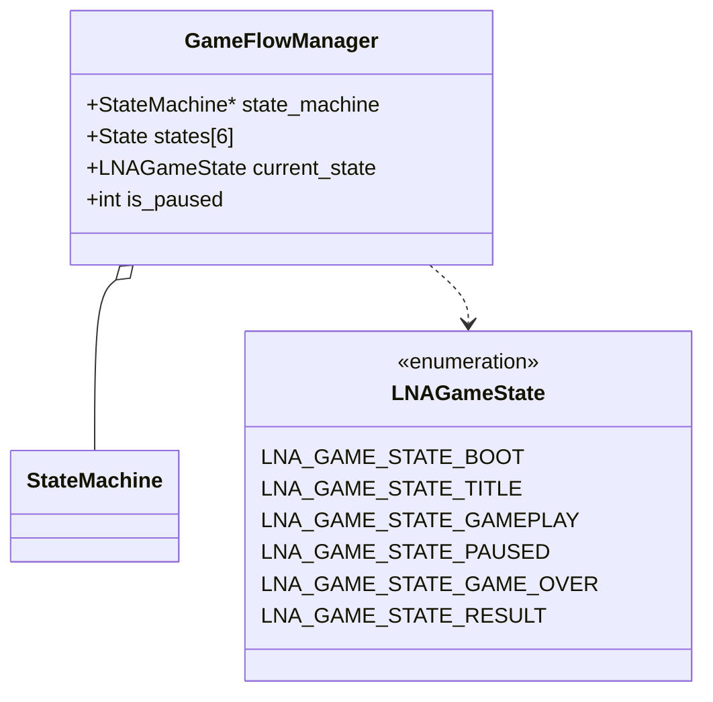
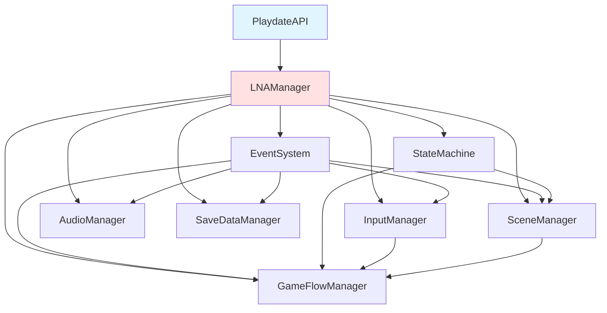

# Playdate Implementation Plan

Playdate (C) 向けのLNA実装計画書です。

## 目次

- [Phase 1: 基礎インフラ](#phase-1-基礎インフラ)
- [Phase 2: コアマネージャー](#phase-2-コアマネージャー)
- [Phase 3: メディアマネージャー](#phase-3-メディアマネージャー)
- [Phase 4: データ永続化](#phase-4-データ永続化)
- [Phase 5: ユーティリティ](#phase-5-ユーティリティ)
- [Phase 6: UIシステム](#phase-6-uiシステム)
- [全体アーキテクチャ](#全体アーキテクチャ)

---

## Playdate特有の設計方針

### メモリ効率の重視

Playdateは限られたメモリ環境で動作するため、以下の点に注意します：

- 動的メモリ確保を最小限に
- 固定サイズのバッファを使用
- ObjectPoolを積極的に活用
- 不要なコピーを避ける

### PlaydateAPI依存

全ての機能はPlaydateAPIを通して実装します。
グローバルな`PlaydateAPI*`ポインタを使用します。

### C言語の制約

- オブジェクト指向を関数ポインタとstructで実現
- 命名規則: `lna_module_function` 形式
- ヘッダーガードとコメントの徹底

---

## Phase 1: 基礎インフラ

### 1.1 LNAManager

#### 構造図



#### データ構造



#### ファイル構成

```
playdate/
├── include/lna/core/
│   └── lna_manager.h
└── src/core/
    └── lna_manager.c
```

#### 実装詳細

**lna_manager.h**

```c
#ifndef LNA_MANAGER_H
#define LNA_MANAGER_H

#include "pd_api.h"
#include "lna/core/input_manager.h"
#include "lna/core/scene_manager.h"
#include "lna/core/audio_manager.h"
#include "lna/core/savedata_manager.h"
#include "lna/core/game_flow_manager.h"
#include "lna/core/event_system.h"

/**
 * @brief LNA Manager structure
 *
 * Central manager that holds references to all subsystems.
 */
typedef struct {
    PlaydateAPI* pd;
    InputManager* input;
    SceneManager* scene;
    AudioManager* audio;
    SaveDataManager* savedata;
    GameFlowManager* gameflow;
    EventSystem* events;
} LNAManager;

/**
 * @brief Get the global LNA manager instance
 * @return Pointer to the LNA manager
 */
LNAManager* lna_get_manager(void);

/**
 * @brief Initialize the LNA manager
 * @param pd Playdate API pointer
 */
void lna_manager_init(PlaydateAPI* pd);

/**
 * @brief Update all LNA systems
 *
 * Call this every frame from your update callback.
 */
void lna_manager_update(void);

/**
 * @brief Shutdown the LNA manager
 *
 * Frees all allocated resources.
 */
void lna_manager_shutdown(void);

// Individual manager accessors
InputManager* lna_get_input(void);
SceneManager* lna_get_scene(void);
AudioManager* lna_get_audio(void);
SaveDataManager* lna_get_savedata(void);
GameFlowManager* lna_get_gameflow(void);
EventSystem* lna_get_events(void);

#endif // LNA_MANAGER_H
```

**lna_manager.c**

```c
#include "lna/core/lna_manager.h"
#include <stdlib.h>

// Global instance
static LNAManager g_lna_manager = {0};

LNAManager* lna_get_manager(void) {
    return &g_lna_manager;
}

void lna_manager_init(PlaydateAPI* pd) {
    g_lna_manager.pd = pd;

    pd->system->logToConsole("[LNAManager] Initializing all managers...");

    // Initialize subsystems in dependency order
    g_lna_manager.events = lna_events_new();
    g_lna_manager.input = lna_input_new(pd);
    g_lna_manager.scene = lna_scene_new();
    g_lna_manager.audio = lna_audio_new(pd);
    g_lna_manager.savedata = lna_savedata_new(pd);
    g_lna_manager.gameflow = lna_gameflow_new();

    pd->system->logToConsole("[LNAManager] All managers initialized.");
}

void lna_manager_update(void) {
    // Update order matters!
    lna_input_update(g_lna_manager.input);
    lna_scene_update(g_lna_manager.scene);
    lna_gameflow_update(g_lna_manager.gameflow);
}

void lna_manager_shutdown(void) {
    PlaydateAPI* pd = g_lna_manager.pd;
    pd->system->logToConsole("[LNAManager] Shutting down all managers...");

    // Shutdown in reverse order
    lna_gameflow_free(g_lna_manager.gameflow);
    lna_savedata_free(g_lna_manager.savedata);
    lna_audio_free(g_lna_manager.audio);
    lna_scene_free(g_lna_manager.scene);
    lna_input_free(g_lna_manager.input);
    lna_events_free(g_lna_manager.events);

    // Clear the struct
    g_lna_manager = (LNAManager){0};
}

// Accessor functions
InputManager* lna_get_input(void) { return g_lna_manager.input; }
SceneManager* lna_get_scene(void) { return g_lna_manager.scene; }
AudioManager* lna_get_audio(void) { return g_lna_manager.audio; }
SaveDataManager* lna_get_savedata(void) { return g_lna_manager.savedata; }
GameFlowManager* lna_get_gameflow(void) { return g_lna_manager.gameflow; }
EventSystem* lna_get_events(void) { return g_lna_manager.events; }
```

---

### 1.2 StateMachine

#### データ構造



#### ファイル構成

```
playdate/
├── include/lna/core/
│   └── state_machine.h
└── src/core/
    └── state_machine.c
```

#### 実装詳細

**state_machine.h**

```c
#ifndef LNA_STATE_MACHINE_H
#define LNA_STATE_MACHINE_H

/**
 * @brief State structure
 */
typedef struct State State;

/**
 * @brief State machine structure
 */
typedef struct StateMachine StateMachine;

// State callback function pointers
typedef void (*StateEnterFunc)(State* state);
typedef void (*StateUpdateFunc)(State* state);
typedef void (*StateExitFunc)(State* state);

struct State {
    const char* name;
    void* data;  // Custom state data
    StateEnterFunc enter;
    StateUpdateFunc update;
    StateExitFunc exit;
};

/**
 * @brief Create a new state machine
 * @return Pointer to the created state machine
 */
StateMachine* lna_statemachine_new(void);

/**
 * @brief Free a state machine
 * @param sm State machine to free
 */
void lna_statemachine_free(StateMachine* sm);

/**
 * @brief Initialize the state machine with a starting state
 * @param sm State machine
 * @param starting_state Initial state
 */
void lna_statemachine_init(StateMachine* sm, State* starting_state);

/**
 * @brief Change to a new state
 * @param sm State machine
 * @param new_state New state to transition to
 */
void lna_statemachine_change(StateMachine* sm, State* new_state);

/**
 * @brief Update the current state
 * @param sm State machine
 */
void lna_statemachine_update(StateMachine* sm);

/**
 * @brief Get the current state
 * @param sm State machine
 * @return Current state
 */
State* lna_statemachine_get_current(StateMachine* sm);

/**
 * @brief Get the previous state
 * @param sm State machine
 * @return Previous state
 */
State* lna_statemachine_get_previous(StateMachine* sm);

#endif // LNA_STATE_MACHINE_H
```

**state_machine.c**

```c
#include "lna/core/state_machine.h"
#include <stdlib.h>

struct StateMachine {
    State* current_state;
    State* previous_state;
};

StateMachine* lna_statemachine_new(void) {
    StateMachine* sm = (StateMachine*)malloc(sizeof(StateMachine));
    if (sm) {
        sm->current_state = NULL;
        sm->previous_state = NULL;
    }
    return sm;
}

void lna_statemachine_free(StateMachine* sm) {
    if (sm) {
        // Exit current state before freeing
        if (sm->current_state && sm->current_state->exit) {
            sm->current_state->exit(sm->current_state);
        }
        free(sm);
    }
}

void lna_statemachine_init(StateMachine* sm, State* starting_state) {
    if (!sm) return;

    sm->current_state = starting_state;
    if (sm->current_state && sm->current_state->enter) {
        sm->current_state->enter(sm->current_state);
    }
}

void lna_statemachine_change(StateMachine* sm, State* new_state) {
    if (!sm || !new_state) return;

    // Don't change if already in this state
    if (sm->current_state == new_state) {
        return;
    }

    // Exit current state
    if (sm->current_state && sm->current_state->exit) {
        sm->current_state->exit(sm->current_state);
    }

    // Update references
    sm->previous_state = sm->current_state;
    sm->current_state = new_state;

    // Enter new state
    if (sm->current_state && sm->current_state->enter) {
        sm->current_state->enter(sm->current_state);
    }
}

void lna_statemachine_update(StateMachine* sm) {
    if (sm && sm->current_state && sm->current_state->update) {
        sm->current_state->update(sm->current_state);
    }
}

State* lna_statemachine_get_current(StateMachine* sm) {
    return sm ? sm->current_state : NULL;
}

State* lna_statemachine_get_previous(StateMachine* sm) {
    return sm ? sm->previous_state : NULL;
}
```

---

### 1.3 EventSystem

#### データ構造



#### ファイル構成

```
playdate/
├── include/lna/core/
│   └── event_system.h
└── src/core/
    └── event_system.c
```

#### 実装詳細

**event_system.h**

```c
#ifndef LNA_EVENT_SYSTEM_H
#define LNA_EVENT_SYSTEM_H

/**
 * @brief Event system for decoupled communication
 */
typedef struct EventSystem EventSystem;

/**
 * @brief Event callback function pointer
 * @param data Custom event data
 */
typedef void (*EventCallback)(void* data);

/**
 * @brief Create a new event system
 * @return Pointer to the created event system
 */
EventSystem* lna_events_new(void);

/**
 * @brief Free an event system
 * @param events Event system to free
 */
void lna_events_free(EventSystem* events);

/**
 * @brief Subscribe to an event
 * @param events Event system
 * @param event_name Name of the event
 * @param callback Callback function
 */
void lna_events_subscribe(EventSystem* events, const char* event_name, EventCallback callback);

/**
 * @brief Unsubscribe from an event
 * @param events Event system
 * @param event_name Name of the event
 * @param callback Callback function to remove
 */
void lna_events_unsubscribe(EventSystem* events, const char* event_name, EventCallback callback);

/**
 * @brief Trigger an event
 * @param events Event system
 * @param event_name Name of the event
 * @param data Custom event data
 */
void lna_events_trigger(EventSystem* events, const char* event_name, void* data);

/**
 * @brief Clear all events
 * @param events Event system
 */
void lna_events_clear(EventSystem* events);

// Common event names
#define LNA_EVENT_SCENE_LOAD_START "scene.load.start"
#define LNA_EVENT_SCENE_LOAD_COMPLETE "scene.load.complete"
#define LNA_EVENT_SCENE_UNLOAD "scene.unload"

#define LNA_EVENT_GAME_STATE_CHANGED "gameflow.state.changed"
#define LNA_EVENT_GAME_PAUSED "gameflow.paused"
#define LNA_EVENT_GAME_RESUMED "gameflow.resumed"

#define LNA_EVENT_BGM_STARTED "audio.bgm.started"
#define LNA_EVENT_BGM_STOPPED "audio.bgm.stopped"

#define LNA_EVENT_INPUT_ACTION "input.action.triggered"

#define LNA_EVENT_SAVE_COMPLETED "savedata.save.completed"
#define LNA_EVENT_LOAD_COMPLETED "savedata.load.completed"

#endif // LNA_EVENT_SYSTEM_H
```

**event_system.c**

```c
#include "lna/core/event_system.h"
#include <stdlib.h>
#include <string.h>

#define MAX_EVENT_TYPES 32

typedef struct EventListener {
    const char* event_name;
    EventCallback callback;
    struct EventListener* next;
} EventListener;

struct EventSystem {
    EventListener* listeners[MAX_EVENT_TYPES];
    int listener_count;
};

// Simple hash function for event names
static unsigned int hash_event_name(const char* name) {
    unsigned int hash = 0;
    while (*name) {
        hash = (hash << 5) + hash + *name++;
    }
    return hash % MAX_EVENT_TYPES;
}

EventSystem* lna_events_new(void) {
    EventSystem* events = (EventSystem*)malloc(sizeof(EventSystem));
    if (events) {
        for (int i = 0; i < MAX_EVENT_TYPES; i++) {
            events->listeners[i] = NULL;
        }
        events->listener_count = 0;
    }
    return events;
}

void lna_events_free(EventSystem* events) {
    if (!events) return;

    lna_events_clear(events);
    free(events);
}

void lna_events_subscribe(EventSystem* events, const char* event_name, EventCallback callback) {
    if (!events || !event_name || !callback) return;

    unsigned int index = hash_event_name(event_name);

    // Create new listener
    EventListener* listener = (EventListener*)malloc(sizeof(EventListener));
    if (!listener) return;

    listener->event_name = event_name;
    listener->callback = callback;
    listener->next = events->listeners[index];

    events->listeners[index] = listener;
    events->listener_count++;
}

void lna_events_unsubscribe(EventSystem* events, const char* event_name, EventCallback callback) {
    if (!events || !event_name || !callback) return;

    unsigned int index = hash_event_name(event_name);
    EventListener** current = &events->listeners[index];

    while (*current) {
        EventListener* listener = *current;
        if (strcmp(listener->event_name, event_name) == 0 && listener->callback == callback) {
            *current = listener->next;
            free(listener);
            events->listener_count--;
            return;
        }
        current = &listener->next;
    }
}

void lna_events_trigger(EventSystem* events, const char* event_name, void* data) {
    if (!events || !event_name) return;

    unsigned int index = hash_event_name(event_name);
    EventListener* listener = events->listeners[index];

    while (listener) {
        if (strcmp(listener->event_name, event_name) == 0) {
            listener->callback(data);
        }
        listener = listener->next;
    }
}

void lna_events_clear(EventSystem* events) {
    if (!events) return;

    for (int i = 0; i < MAX_EVENT_TYPES; i++) {
        EventListener* listener = events->listeners[i];
        while (listener) {
            EventListener* next = listener->next;
            free(listener);
            listener = next;
        }
        events->listeners[i] = NULL;
    }
    events->listener_count = 0;
}
```

---

## Phase 2: コアマネージャー

### 2.1 InputManager

#### データ構造



#### ボタン定義

```c
typedef enum {
    LNA_BUTTON_A,
    LNA_BUTTON_B,
    LNA_BUTTON_UP,
    LNA_BUTTON_DOWN,
    LNA_BUTTON_LEFT,
    LNA_BUTTON_RIGHT,
    LNA_BUTTON_COUNT
} LNAButton;
```

#### 実装詳細（抜粋）

**input_manager.h**

```c
#ifndef LNA_INPUT_MANAGER_H
#define LNA_INPUT_MANAGER_H

#include "pd_api.h"

typedef struct InputManager InputManager;

typedef enum {
    LNA_BUTTON_A,
    LNA_BUTTON_B,
    LNA_BUTTON_UP,
    LNA_BUTTON_DOWN,
    LNA_BUTTON_LEFT,
    LNA_BUTTON_RIGHT,
    LNA_BUTTON_COUNT
} LNAButton;

// Lifecycle
InputManager* lna_input_new(PlaydateAPI* pd);
void lna_input_free(InputManager* input);
void lna_input_update(InputManager* input);

// Button state
int lna_input_is_pressed(InputManager* input, LNAButton button);
int lna_input_is_just_pressed(InputManager* input, LNAButton button);
int lna_input_is_just_released(InputManager* input, LNAButton button);

// Crank (Playdate specific)
float lna_input_get_crank_angle(InputManager* input);
float lna_input_get_crank_change(InputManager* input);
int lna_input_is_crank_docked(InputManager* input);

// Action mapping
void lna_input_register_action(InputManager* input, const char* action_name, LNAButton button);
int lna_input_get_action(InputManager* input, const char* action_name);
int lna_input_get_action_down(InputManager* input, const char* action_name);

#endif // LNA_INPUT_MANAGER_H
```

---

### 2.2 SceneManager

#### データ構造



#### 実装詳細（抜粋）

**scene_manager.h**

```c
#ifndef LNA_SCENE_MANAGER_H
#define LNA_SCENE_MANAGER_H

typedef struct SceneManager SceneManager;
typedef struct Scene Scene;

// Scene callback function pointers
typedef void (*SceneLoadFunc)(Scene* scene);
typedef void (*SceneUnloadFunc)(Scene* scene);
typedef void (*SceneUpdateFunc)(Scene* scene);
typedef void (*SceneDrawFunc)(Scene* scene);

struct Scene {
    const char* name;
    void* data;  // Custom scene data
    SceneLoadFunc load;
    SceneUnloadFunc unload;
    SceneUpdateFunc update;
    SceneDrawFunc draw;
};

// Scene manager
SceneManager* lna_scene_new(void);
void lna_scene_free(SceneManager* sm);

void lna_scene_register(SceneManager* sm, Scene* scene);
void lna_scene_load(SceneManager* sm, const char* scene_name);
void lna_scene_reload(SceneManager* sm);
void lna_scene_go_back(SceneManager* sm);
int lna_scene_can_go_back(SceneManager* sm);

Scene* lna_scene_get_current(SceneManager* sm);
const char* lna_scene_get_current_name(SceneManager* sm);
int lna_scene_is_loading(SceneManager* sm);

void lna_scene_update(SceneManager* sm);
void lna_scene_draw(SceneManager* sm);

#endif // LNA_SCENE_MANAGER_H
```

---

### 2.3 GameFlowManager

#### データ構造



#### 実装詳細（抜粋）

**game_flow_manager.h**

```c
#ifndef LNA_GAME_FLOW_MANAGER_H
#define LNA_GAME_FLOW_MANAGER_H

typedef struct GameFlowManager GameFlowManager;

typedef enum {
    LNA_GAME_STATE_BOOT,
    LNA_GAME_STATE_TITLE,
    LNA_GAME_STATE_GAMEPLAY,
    LNA_GAME_STATE_PAUSED,
    LNA_GAME_STATE_GAME_OVER,
    LNA_GAME_STATE_RESULT
} LNAGameState;

// Lifecycle
GameFlowManager* lna_gameflow_new(void);
void lna_gameflow_free(GameFlowManager* gf);

// State management
void lna_gameflow_change_state(GameFlowManager* gf, LNAGameState new_state);
LNAGameState lna_gameflow_get_current_state(GameFlowManager* gf);

// Pause/Resume
void lna_gameflow_pause(GameFlowManager* gf);
void lna_gameflow_resume(GameFlowManager* gf);
int lna_gameflow_is_paused(GameFlowManager* gf);

// Game flow
void lna_gameflow_restart(GameFlowManager* gf);
void lna_gameflow_quit_to_title(GameFlowManager* gf);

// Queries
int lna_gameflow_is_in_gameplay(GameFlowManager* gf);
int lna_gameflow_can_pause(GameFlowManager* gf);

// Update
void lna_gameflow_update(GameFlowManager* gf);

#endif // LNA_GAME_FLOW_MANAGER_H
```

---

## 全体アーキテクチャ

### 依存関係図



### メモリ管理方針

| コンポーネント | 確保タイミング | 解放タイミング |
|--------------|--------------|--------------|
| LNAManager | 起動時（グローバル静的変数） | シャットダウン時 |
| InputManager | 初期化時 | シャットダウン時 |
| SceneManager | 初期化時 | シャットダウン時 |
| EventSystem | 初期化時 | シャットダウン時 |
| GameFlowManager | 初期化時 | シャットダウン時 |
| Scene | 登録時 | シーン切り替え時 |
| State | 初期化時（固定配列） | シャットダウン時 |

### ファイル構成

```
playdate/
├── include/lna/
│   └── core/
│       ├── lna_manager.h
│       ├── state_machine.h
│       ├── event_system.h
│       ├── input_manager.h
│       ├── scene_manager.h
│       └── game_flow_manager.h
└── src/
    └── core/
        ├── lna_manager.c
        ├── state_machine.c
        ├── event_system.c
        ├── input_manager.c
        ├── scene_manager.c
        └── game_flow_manager.c
```

---

## Phase 3以降

Phase 3 (AudioManager, ResourceManager), Phase 4 (SaveDataManager), Phase 5 (Timer, Tween, ObjectPool), Phase 6 (UI Systems) の詳細設計も同様に行います。

---

## 実装チェックリスト

### Milestone 1: 基礎インフラ

- [ ] `lna_manager` 実装
- [ ] `state_machine` 実装
- [ ] `event_system` 実装
- [ ] イベント定数定義
- [ ] テストコード作成
- [ ] サンプルプロジェクト作成

### Milestone 2: コアマネージャー

- [ ] `input_manager` 実装
- [ ] `scene_manager` 実装
- [ ] `game_flow_manager` 実装
- [ ] ゲーム状態実装 (6種類)
- [ ] 統合テスト作成
- [ ] デモゲーム作成（タイトル→ゲーム→結果）

---

## Playdate特有の注意事項

### メモリ制限

- ヒープは16MB
- 動的確保は慎重に
- `malloc`/`free`の回数を最小限に

### パフォーマンス

- CPUは180MHz ARM Cortex-M7
- 浮動小数点演算は遅い
- ビットマップ描画は最適化されている

### クランク入力

Playdate特有のクランク入力は`InputManager`で対応：

```c
float angle = lna_input_get_crank_angle(lna_get_input());
float change = lna_input_get_crank_change(lna_get_input());
```

---

## 次のステップ

1. Milestone 1 の実装開始
2. 各モジュールのテストコード作成
3. サンプルプロジェクトで動作確認
4. Milestone 2 へ進む
