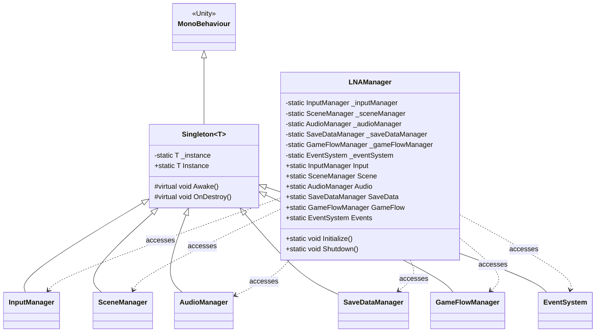
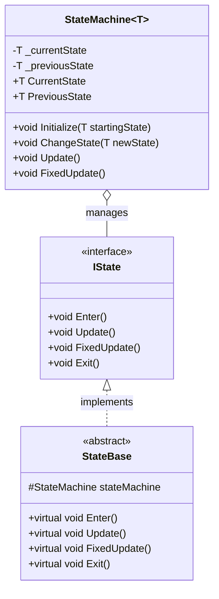
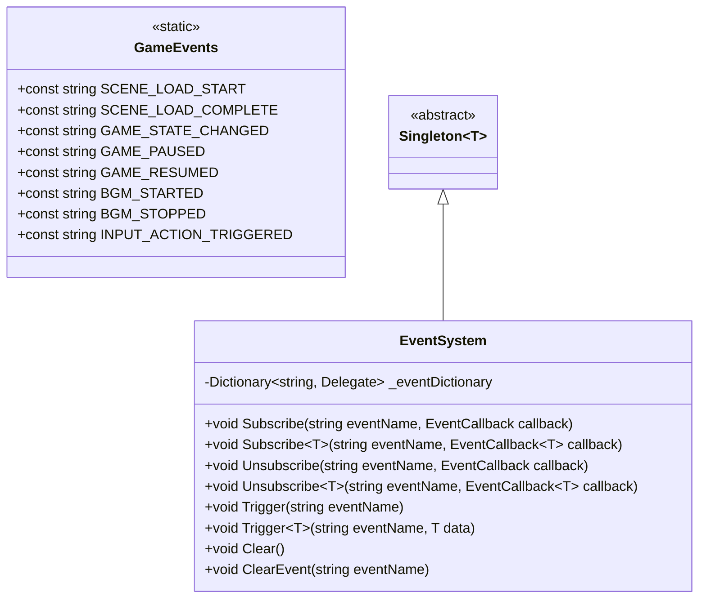
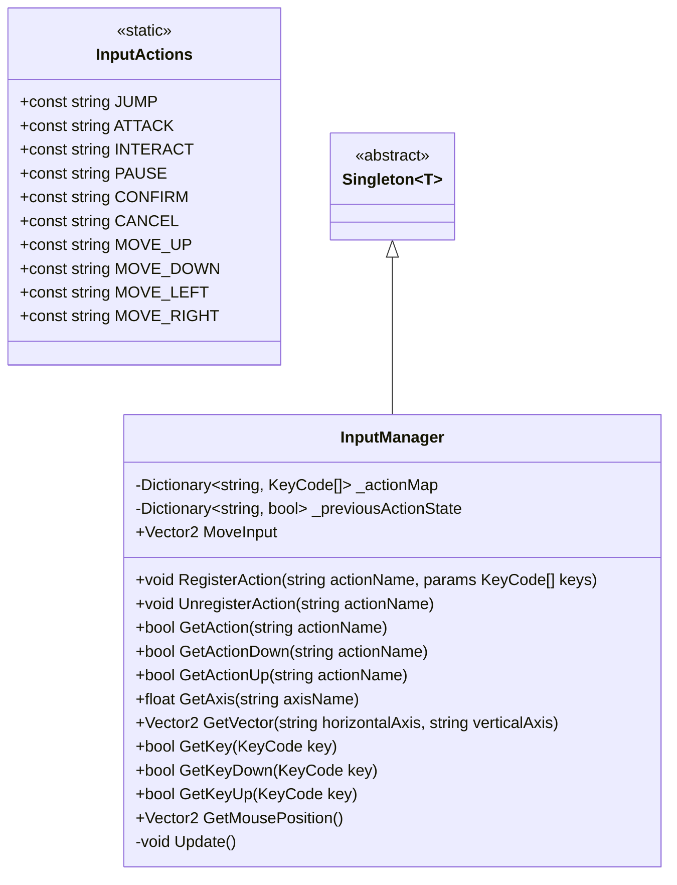
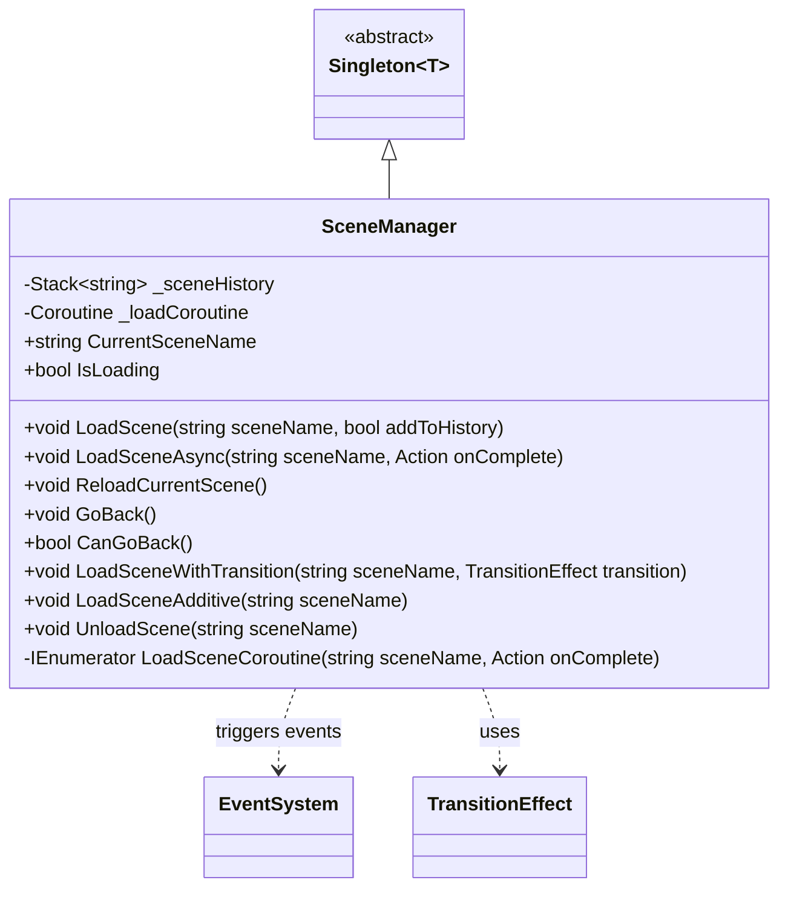
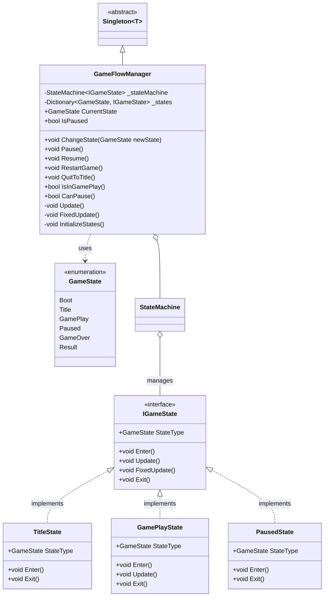
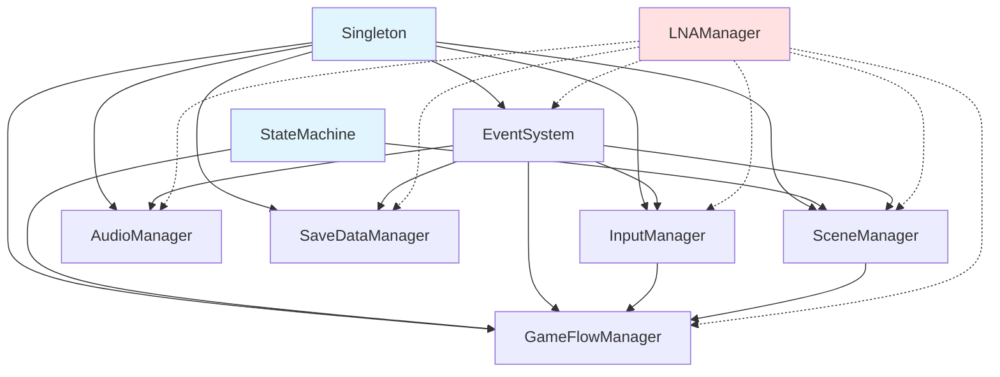

# Unity Implementation Plan

Unity (C#) 向けのLNA実装計画書です。

## 目次

- [Phase 1: 基礎インフラ](#phase-1-基礎インフラ)
- [Phase 2: コアマネージャー](#phase-2-コアマネージャー)
- [Phase 3: メディアマネージャー](#phase-3-メディアマネージャー)
- [Phase 4: データ永続化](#phase-4-データ永続化)
- [Phase 5: ユーティリティ](#phase-5-ユーティリティ)
- [Phase 6: UIシステム](#phase-6-uiシステム)
- [全体アーキテクチャ](#全体アーキテクチャ)

---

## Phase 1: 基礎インフラ

### 1.1 シングルトンシステム

#### クラス図



#### ファイル構成

```
unity/Core/
├── Singleton.cs
└── LNAManager.cs
```

#### 実装詳細

**Singleton.cs**

```csharp
using UnityEngine;

namespace LNA
{
    public class Singleton<T> : MonoBehaviour where T : MonoBehaviour
    {
        private static T _instance;
        private static readonly object _lock = new object();
        private static bool _isQuitting = false;

        public static T Instance
        {
            get
            {
                if (_isQuitting)
                {
                    Debug.LogWarning($"[Singleton] Instance of {typeof(T)} is already destroyed.");
                    return null;
                }

                lock (_lock)
                {
                    if (_instance == null)
                    {
                        _instance = FindObjectOfType<T>();

                        if (_instance == null)
                        {
                            GameObject singletonObject = new GameObject();
                            _instance = singletonObject.AddComponent<T>();
                            singletonObject.name = $"[Singleton] {typeof(T)}";
                        }
                    }

                    return _instance;
                }
            }
        }

        protected virtual void Awake()
        {
            if (_instance == null)
            {
                _instance = this as T;
                DontDestroyOnLoad(gameObject);
            }
            else if (_instance != this)
            {
                Debug.LogWarning($"[Singleton] Duplicate instance of {typeof(T)} detected. Destroying.");
                Destroy(gameObject);
            }
        }

        protected virtual void OnDestroy()
        {
            if (_instance == this)
            {
                _isQuitting = true;
            }
        }

        protected virtual void OnApplicationQuit()
        {
            _isQuitting = true;
        }
    }
}
```

**LNAManager.cs**

```csharp
using UnityEngine;

namespace LNA
{
    public static class LNAManager
    {
        // Manager references
        private static InputManager _inputManager;
        private static SceneManager _sceneManager;
        private static AudioManager _audioManager;
        private static SaveDataManager _saveDataManager;
        private static GameFlowManager _gameFlowManager;
        private static EventSystem _eventSystem;

        // Public accessors
        public static InputManager Input => _inputManager ?? (_inputManager = InputManager.Instance);
        public static SceneManager Scene => _sceneManager ?? (_sceneManager = SceneManager.Instance);
        public static AudioManager Audio => _audioManager ?? (_audioManager = AudioManager.Instance);
        public static SaveDataManager SaveData => _saveDataManager ?? (_saveDataManager = SaveDataManager.Instance);
        public static GameFlowManager GameFlow => _gameFlowManager ?? (_gameFlowManager = GameFlowManager.Instance);
        public static EventSystem Events => _eventSystem ?? (_eventSystem = EventSystem.Instance);

        /// <summary>
        /// Initialize all LNA managers. Call this in your game's startup.
        /// </summary>
        public static void Initialize()
        {
            Debug.Log("[LNAManager] Initializing all managers...");

            // Force initialization of all managers
            _ = Events;
            _ = Input;
            _ = Scene;
            _ = Audio;
            _ = SaveData;
            _ = GameFlow;

            Debug.Log("[LNAManager] All managers initialized.");
        }

        /// <summary>
        /// Shutdown all LNA managers.
        /// </summary>
        public static void Shutdown()
        {
            Debug.Log("[LNAManager] Shutting down all managers...");

            // Clear references
            _inputManager = null;
            _sceneManager = null;
            _audioManager = null;
            _saveDataManager = null;
            _gameFlowManager = null;
            _eventSystem = null;
        }
    }
}
```

---

### 1.2 StateMachine

#### クラス図



#### ファイル構成

```
unity/Core/StateMachine/
├── IState.cs
├── StateMachine.cs
└── StateBase.cs
```

#### 実装詳細

**IState.cs**

```csharp
namespace LNA
{
    public interface IState
    {
        void Enter();
        void Update();
        void FixedUpdate();
        void Exit();
    }
}
```

**StateMachine.cs**

```csharp
using UnityEngine;

namespace LNA
{
    public class StateMachine<T> where T : IState
    {
        public T CurrentState { get; private set; }
        public T PreviousState { get; private set; }

        public void Initialize(T startingState)
        {
            CurrentState = startingState;
            CurrentState?.Enter();
        }

        public void ChangeState(T newState)
        {
            if (CurrentState != null && CurrentState.Equals(newState))
            {
                Debug.LogWarning($"[StateMachine] Already in state {newState}");
                return;
            }

            CurrentState?.Exit();
            PreviousState = CurrentState;
            CurrentState = newState;
            CurrentState?.Enter();
        }

        public void Update()
        {
            CurrentState?.Update();
        }

        public void FixedUpdate()
        {
            CurrentState?.FixedUpdate();
        }
    }
}
```

**StateBase.cs**

```csharp
namespace LNA
{
    public abstract class StateBase : IState
    {
        protected object stateMachine;

        public virtual void Enter() { }
        public virtual void Update() { }
        public virtual void FixedUpdate() { }
        public virtual void Exit() { }
    }
}
```

---

### 1.3 EventSystem

#### クラス図



#### ファイル構成

```
unity/Core/EventSystem/
├── EventSystem.cs
└── GameEvents.cs
```

#### 実装詳細

**EventSystem.cs**

```csharp
using System;
using System.Collections.Generic;
using UnityEngine;

namespace LNA
{
    public class EventSystem : Singleton<EventSystem>
    {
        // Delegate types
        public delegate void EventCallback();
        public delegate void EventCallback<T>(T data);

        private Dictionary<string, Delegate> _eventDictionary = new Dictionary<string, Delegate>();

        #region Subscribe

        public void Subscribe(string eventName, EventCallback callback)
        {
            if (_eventDictionary.TryGetValue(eventName, out Delegate existingDelegate))
            {
                _eventDictionary[eventName] = Delegate.Combine(existingDelegate, callback);
            }
            else
            {
                _eventDictionary[eventName] = callback;
            }
        }

        public void Subscribe<T>(string eventName, EventCallback<T> callback)
        {
            if (_eventDictionary.TryGetValue(eventName, out Delegate existingDelegate))
            {
                _eventDictionary[eventName] = Delegate.Combine(existingDelegate, callback);
            }
            else
            {
                _eventDictionary[eventName] = callback;
            }
        }

        #endregion

        #region Unsubscribe

        public void Unsubscribe(string eventName, EventCallback callback)
        {
            if (_eventDictionary.TryGetValue(eventName, out Delegate existingDelegate))
            {
                Delegate newDelegate = Delegate.Remove(existingDelegate, callback);

                if (newDelegate == null)
                {
                    _eventDictionary.Remove(eventName);
                }
                else
                {
                    _eventDictionary[eventName] = newDelegate;
                }
            }
        }

        public void Unsubscribe<T>(string eventName, EventCallback<T> callback)
        {
            if (_eventDictionary.TryGetValue(eventName, out Delegate existingDelegate))
            {
                Delegate newDelegate = Delegate.Remove(existingDelegate, callback);

                if (newDelegate == null)
                {
                    _eventDictionary.Remove(eventName);
                }
                else
                {
                    _eventDictionary[eventName] = newDelegate;
                }
            }
        }

        #endregion

        #region Trigger

        public void Trigger(string eventName)
        {
            if (_eventDictionary.TryGetValue(eventName, out Delegate eventDelegate))
            {
                EventCallback callback = eventDelegate as EventCallback;
                callback?.Invoke();
            }
        }

        public void Trigger<T>(string eventName, T data)
        {
            if (_eventDictionary.TryGetValue(eventName, out Delegate eventDelegate))
            {
                EventCallback<T> callback = eventDelegate as EventCallback<T>;
                callback?.Invoke(data);
            }
        }

        #endregion

        #region Clear

        public void Clear()
        {
            _eventDictionary.Clear();
        }

        public void ClearEvent(string eventName)
        {
            if (_eventDictionary.ContainsKey(eventName))
            {
                _eventDictionary.Remove(eventName);
            }
        }

        #endregion
    }
}
```

**GameEvents.cs**

```csharp
namespace LNA
{
    public static class GameEvents
    {
        // Scene events
        public const string SCENE_LOAD_START = "scene.load.start";
        public const string SCENE_LOAD_COMPLETE = "scene.load.complete";
        public const string SCENE_UNLOAD = "scene.unload";

        // Game flow events
        public const string GAME_STATE_CHANGED = "gameflow.state.changed";
        public const string GAME_PAUSED = "gameflow.paused";
        public const string GAME_RESUMED = "gameflow.resumed";

        // Audio events
        public const string BGM_STARTED = "audio.bgm.started";
        public const string BGM_STOPPED = "audio.bgm.stopped";
        public const string BGM_FADED = "audio.bgm.faded";
        public const string SFX_PLAYED = "audio.sfx.played";

        // Input events
        public const string INPUT_ACTION_TRIGGERED = "input.action.triggered";

        // Save/Load events
        public const string SAVE_COMPLETED = "savedata.save.completed";
        public const string LOAD_COMPLETED = "savedata.load.completed";
    }
}
```

---

## Phase 2: コアマネージャー

### 2.1 InputManager

#### クラス図



#### ファイル構成

```
unity/Core/
├── InputManager.cs
└── InputActions.cs
```

#### 実装詳細

**InputManager.cs**

```csharp
using System.Collections.Generic;
using UnityEngine;

namespace LNA
{
    public class InputManager : Singleton<InputManager>
    {
        private Dictionary<string, KeyCode[]> _actionMap = new Dictionary<string, KeyCode[]>();
        private Dictionary<string, bool> _previousActionState = new Dictionary<string, bool>();

        public Vector2 MoveInput { get; private set; }

        #region Action Registration

        public void RegisterAction(string actionName, params KeyCode[] keys)
        {
            if (_actionMap.ContainsKey(actionName))
            {
                Debug.LogWarning($"[InputManager] Action '{actionName}' already registered. Overwriting.");
            }

            _actionMap[actionName] = keys;
            _previousActionState[actionName] = false;
        }

        public void UnregisterAction(string actionName)
        {
            _actionMap.Remove(actionName);
            _previousActionState.Remove(actionName);
        }

        #endregion

        #region Action Queries

        public bool GetAction(string actionName)
        {
            if (!_actionMap.TryGetValue(actionName, out KeyCode[] keys))
            {
                return false;
            }

            foreach (var key in keys)
            {
                if (Input.GetKey(key))
                {
                    return true;
                }
            }

            return false;
        }

        public bool GetActionDown(string actionName)
        {
            if (!_actionMap.TryGetValue(actionName, out KeyCode[] keys))
            {
                return false;
            }

            foreach (var key in keys)
            {
                if (Input.GetKeyDown(key))
                {
                    return true;
                }
            }

            return false;
        }

        public bool GetActionUp(string actionName)
        {
            if (!_actionMap.TryGetValue(actionName, out KeyCode[] keys))
            {
                return false;
            }

            foreach (var key in keys)
            {
                if (Input.GetKeyUp(key))
                {
                    return true;
                }
            }

            return false;
        }

        #endregion

        #region Axis Input

        public float GetAxis(string axisName)
        {
            return Input.GetAxis(axisName);
        }

        public Vector2 GetVector(string horizontalAxis, string verticalAxis)
        {
            float x = GetAxis(horizontalAxis);
            float y = GetAxis(verticalAxis);
            return new Vector2(x, y);
        }

        #endregion

        #region Raw Input

        public bool GetKey(KeyCode key) => Input.GetKey(key);
        public bool GetKeyDown(KeyCode key) => Input.GetKeyDown(key);
        public bool GetKeyUp(KeyCode key) => Input.GetKeyUp(key);
        public Vector2 GetMousePosition() => Input.mousePosition;

        #endregion

        private void Update()
        {
            // Update move input (example)
            float horizontal = GetAxis("Horizontal");
            float vertical = GetAxis("Vertical");
            MoveInput = new Vector2(horizontal, vertical);

            // Trigger events for action inputs
            foreach (var action in _actionMap.Keys)
            {
                bool currentState = GetAction(action);
                bool previousState = _previousActionState[action];

                if (currentState && !previousState)
                {
                    LNAManager.Events?.Trigger(GameEvents.INPUT_ACTION_TRIGGERED, action);
                }

                _previousActionState[action] = currentState;
            }
        }
    }
}
```

**InputActions.cs**

```csharp
namespace LNA
{
    public static class InputActions
    {
        public const string JUMP = "jump";
        public const string ATTACK = "attack";
        public const string INTERACT = "interact";
        public const string PAUSE = "pause";
        public const string CONFIRM = "confirm";
        public const string CANCEL = "cancel";
        public const string MOVE_UP = "move_up";
        public const string MOVE_DOWN = "move_down";
        public const string MOVE_LEFT = "move_left";
        public const string MOVE_RIGHT = "move_right";
    }
}
```

---

### 2.2 SceneManager

#### クラス図



#### 実装詳細

**SceneManager.cs**

```csharp
using System;
using System.Collections;
using System.Collections.Generic;
using UnityEngine;
using UnitySceneManager = UnityEngine.SceneManagement.SceneManager;
using UnityScene = UnityEngine.SceneManagement.Scene;

namespace LNA
{
    public class SceneManager : Singleton<SceneManager>
    {
        private Stack<string> _sceneHistory = new Stack<string>();
        private Coroutine _loadCoroutine;

        public string CurrentSceneName { get; private set; }
        public bool IsLoading { get; private set; }

        #region Scene Loading

        public void LoadScene(string sceneName, bool addToHistory = true)
        {
            if (IsLoading)
            {
                Debug.LogWarning($"[SceneManager] Already loading a scene. Cannot load '{sceneName}'.");
                return;
            }

            if (addToHistory && !string.IsNullOrEmpty(CurrentSceneName))
            {
                _sceneHistory.Push(CurrentSceneName);
            }

            LNAManager.Events?.Trigger(GameEvents.SCENE_LOAD_START, sceneName);
            CurrentSceneName = sceneName;
            UnitySceneManager.LoadScene(sceneName);
            LNAManager.Events?.Trigger(GameEvents.SCENE_LOAD_COMPLETE, sceneName);
        }

        public void LoadSceneAsync(string sceneName, Action onComplete = null)
        {
            if (IsLoading)
            {
                Debug.LogWarning($"[SceneManager] Already loading a scene. Cannot load '{sceneName}'.");
                return;
            }

            _loadCoroutine = StartCoroutine(LoadSceneCoroutine(sceneName, onComplete));
        }

        public void ReloadCurrentScene()
        {
            LoadScene(CurrentSceneName, false);
        }

        #endregion

        #region Scene History

        public void GoBack()
        {
            if (!CanGoBack())
            {
                Debug.LogWarning("[SceneManager] No scene to go back to.");
                return;
            }

            string previousScene = _sceneHistory.Pop();
            LoadScene(previousScene, false);
        }

        public bool CanGoBack()
        {
            return _sceneHistory.Count > 0;
        }

        #endregion

        #region Additive Loading

        public void LoadSceneAdditive(string sceneName)
        {
            UnitySceneManager.LoadSceneAsync(sceneName, UnityEngine.SceneManagement.LoadSceneMode.Additive);
        }

        public void UnloadScene(string sceneName)
        {
            UnitySceneManager.UnloadSceneAsync(sceneName);
            LNAManager.Events?.Trigger(GameEvents.SCENE_UNLOAD, sceneName);
        }

        #endregion

        #region Coroutines

        private IEnumerator LoadSceneCoroutine(string sceneName, Action onComplete)
        {
            IsLoading = true;
            LNAManager.Events?.Trigger(GameEvents.SCENE_LOAD_START, sceneName);

            AsyncOperation asyncLoad = UnitySceneManager.LoadSceneAsync(sceneName);

            while (!asyncLoad.isDone)
            {
                // You can expose asyncLoad.progress for loading bars
                yield return null;
            }

            CurrentSceneName = sceneName;
            IsLoading = false;
            LNAManager.Events?.Trigger(GameEvents.SCENE_LOAD_COMPLETE, sceneName);
            onComplete?.Invoke();
        }

        #endregion
    }
}
```

---

### 2.3 GameFlowManager

#### クラス図



#### ファイル構成

```
unity/Core/
├── GameFlowManager.cs
└── GameFlowStates/
    ├── IGameState.cs
    ├── GameState.cs
    ├── BootState.cs
    ├── TitleState.cs
    ├── GamePlayState.cs
    ├── PausedState.cs
    ├── GameOverState.cs
    └── ResultState.cs
```

#### 実装詳細（抜粋）

**GameState.cs**

```csharp
namespace LNA
{
    public enum GameState
    {
        Boot,
        Title,
        GamePlay,
        Paused,
        GameOver,
        Result
    }
}
```

**IGameState.cs**

```csharp
namespace LNA
{
    public interface IGameState : IState
    {
        GameState StateType { get; }
    }
}
```

**GameFlowManager.cs**

```csharp
using System.Collections.Generic;
using UnityEngine;

namespace LNA
{
    public class GameFlowManager : Singleton<GameFlowManager>
    {
        private StateMachine<IGameState> _stateMachine = new StateMachine<IGameState>();
        private Dictionary<GameState, IGameState> _states = new Dictionary<GameState, IGameState>();

        public GameState CurrentState => _stateMachine.CurrentState?.StateType ?? GameState.Boot;
        public bool IsPaused { get; private set; }

        protected override void Awake()
        {
            base.Awake();
            InitializeStates();
            _stateMachine.Initialize(_states[GameState.Boot]);
        }

        private void InitializeStates()
        {
            _states[GameState.Boot] = new BootState();
            _states[GameState.Title] = new TitleState();
            _states[GameState.GamePlay] = new GamePlayState();
            _states[GameState.Paused] = new PausedState();
            _states[GameState.GameOver] = new GameOverState();
            _states[GameState.Result] = new ResultState();
        }

        #region State Control

        public void ChangeState(GameState newState)
        {
            if (_states.TryGetValue(newState, out IGameState state))
            {
                _stateMachine.ChangeState(state);
                LNAManager.Events?.Trigger(GameEvents.GAME_STATE_CHANGED, newState);
            }
            else
            {
                Debug.LogError($"[GameFlowManager] State {newState} not found!");
            }
        }

        public void Pause()
        {
            if (!CanPause()) return;

            IsPaused = true;
            Time.timeScale = 0f;
            ChangeState(GameState.Paused);
            LNAManager.Events?.Trigger(GameEvents.GAME_PAUSED);
        }

        public void Resume()
        {
            IsPaused = false;
            Time.timeScale = 1f;
            ChangeState(GameState.GamePlay);
            LNAManager.Events?.Trigger(GameEvents.GAME_RESUMED);
        }

        public void RestartGame()
        {
            LNAManager.Scene.ReloadCurrentScene();
        }

        public void QuitToTitle()
        {
            Time.timeScale = 1f;
            IsPaused = false;
            LNAManager.Scene.LoadScene("TitleScene", false);
            ChangeState(GameState.Title);
        }

        #endregion

        #region Queries

        public bool IsInGamePlay() => CurrentState == GameState.GamePlay;
        public bool CanPause() => CurrentState == GameState.GamePlay;

        #endregion

        private void Update()
        {
            _stateMachine.Update();
        }

        private void FixedUpdate()
        {
            _stateMachine.FixedUpdate();
        }
    }
}
```

---

## 全体アーキテクチャ

### 依存関係図



### クラス一覧とファイルパス

| クラス名 | ファイルパス | 説明 |
|---------|-------------|------|
| `Singleton<T>` | `unity/Core/Singleton.cs` | シングルトン基底クラス |
| `LNAManager` | `unity/Core/LNAManager.cs` | 統合アクセサ |
| `IState` | `unity/Core/StateMachine/IState.cs` | State インターフェース |
| `StateMachine<T>` | `unity/Core/StateMachine/StateMachine.cs` | ステートマシン |
| `StateBase` | `unity/Core/StateMachine/StateBase.cs` | State 基底クラス |
| `EventSystem` | `unity/Core/EventSystem/EventSystem.cs` | イベントシステム |
| `GameEvents` | `unity/Core/EventSystem/GameEvents.cs` | イベント定数 |
| `InputManager` | `unity/Core/InputManager.cs` | 入力管理 |
| `InputActions` | `unity/Core/InputActions.cs` | 入力アクション定数 |
| `SceneManager` | `unity/Core/SceneManager.cs` | シーン管理 |
| `GameFlowManager` | `unity/Core/GameFlowManager.cs` | ゲームフロー管理 |
| `GameState` | `unity/Core/GameFlowStates/GameState.cs` | ゲーム状態enum |
| `IGameState` | `unity/Core/GameFlowStates/IGameState.cs` | ゲーム状態インターフェース |

---

## Phase 3以降

Phase 3 (AudioManager, ResourceManager), Phase 4 (SaveDataManager), Phase 5 (Timer, Tween, ObjectPool), Phase 6 (UI Systems) の詳細設計も同様に行います。

実装の優先順位に応じて、次のフェーズのクラス図と実装を追加していきます。

---

## 実装チェックリスト

### Milestone 1: 基礎インフラ

- [ ] `Singleton<T>` 実装
- [ ] `LNAManager` 実装
- [ ] `IState` + `StateMachine<T>` 実装
- [ ] `StateBase` 実装
- [ ] `EventSystem` 実装
- [ ] `GameEvents` 定義
- [ ] ユニットテスト作成
- [ ] サンプルシーン作成

### Milestone 2: コアマネージャー

- [ ] `InputManager` 実装
- [ ] `InputActions` 定義
- [ ] `SceneManager` 実装
- [ ] `GameFlowManager` 実装
- [ ] `GameState` enum + States 実装
- [ ] 統合テスト作成
- [ ] デモゲーム作成（タイトル→ゲーム→結果）

---

## 次のステップ

1. Milestone 1 の実装開始
2. 各クラスのユニットテスト作成
3. サンプルシーンで動作確認
4. Milestone 2 へ進む
